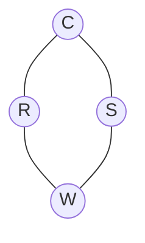

It's a way to query some probabilities on a [[Bayesian network]].
The main idea is to draw N samples from a sample distribution and compute from them the approximate posterior probability.
The error can be computed both [[Relative error]] and [[Absolute error]] but, for each of them, having an error < .5 and a failure rate for the algorithm of <.5 is np-hard.

# Sampling from an empty network

We start by sampling from an empty network, we extract a value for each variable in topological order, and then we compute the values for each of the others variables.
Example:

With:
P(C) = 0.5

| C   | P(S\|C) |
| --- | ------- |
| T   | 0.1     |
| F   | 0.5     |


| C | P(R\|C) |
|---|---------|
| T | 0.8     |
| F | 0.2     |


| S | R | P(W\|S,R) |
|---|---|-----------|
| T | T | 0.99      |
| T | F | 0.90      |
| F | T | 0.90      |
| F | F | 0.1       |


If we extract 0.5 for C, 0.3 for S, 0.2 for R and 0.8 for W we will have true for C, R and W and False for S.

Repeating this process N time will generate an approximate sample for the network.

# Rejection sampling

```python
def rejection_sampling(X, e, bn, N):
	vector_count = {}
	for j in N:
		x = get_sample(bn)
		if is_consistent(x, e):
			vector_count[x] += 1
		return normaize(vector_count)
```

Basically, in order to compute P(X|e) we extract from our samplings the samples agreeing with our e and return the normalization of those samples values.

# Likelihood weighting

The procedure is similar to the sampling generation, but fixes the values of our evidences and sample according to them.
