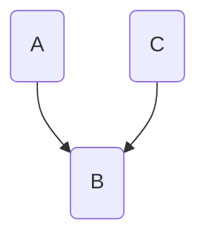
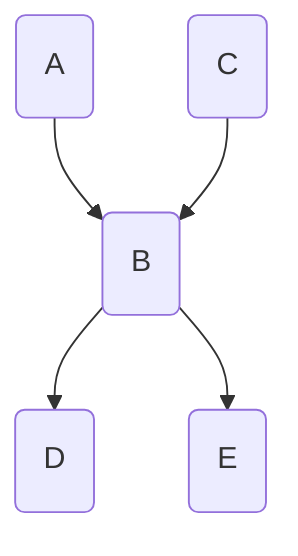

A simple graphical notation of conditional [[statistical indipendence|indipendence]] of [[Random variable|random variables]]. 
It is a graph with a node for each random variable and the nodes are connected with archs when there is a dipendence between the nodes.
Example:
```
P(B|A) != P(A)P(B)
P(C|A) != P(C)P(B)
```
=> 

This graph could be used for reasoning and to predict pattern knowing the state of some random variables (e.g. If C is true then the probability of B encreases...)

### Notation and terms

- X -> Y = direct cause
- X <- Y = direct effect
- X -> Z -> Y = causal trial
- X <- Z <- Y = evidential trial
- X <- Z -> Y = common cause
- X -> Z <- Y = common effect

### Active two edge trail

if influence can flow from X to Y via Z the trail X <-> Z <-> Y is __active__

### D-separation

Two nodes are d-separated given Z if there is no active trail between X and Y given Z.

## Global semantics 

Defines the full joint distribution as the product of the local conditional distributions:
$$
P(x_1, \dots, x_n) = \prod_{i=1}^n P(x_i|\text{Parents}(x_i)) 
$$
Example:



$$
\begin{align}
&P(D \wedge E \wedge B \wedge \neg A \wedge \neg C)=\\
&P(D|B)\times P(E|B)\times P(B|\neg A, \neg C)\times P(\neg A)\times P(\neg C)
\end{align}
$$

## Local semantics

Each node is conditionally indipendent of its non-descendants given its parents.

## Markov blanket

Each node is conditionally indipendent given its blanket (parent + childrens + childrens' parents).

## Construction of a Bayesian network

1) Choose an ordering of variables $X_1, \dots, X_n$
2) for $i \in [1, n]$:
	1) add $X_i$ to the network
	2) select parents from $X_1, X_{i - 1}$ such that $P(X_i|parents(X_i)) = P(X_i| X_1, \dots, X_{i-1})$

### Automatic construction of the network

If a manual approach is not possible, we can use two automatic approach to build the network:
- __Constraint based approach__: define a set of constraint that the graph should have and search a graph that satisfies those constraints.
- __Score based approach__: define a score function to evaluate the network and try to maximize it