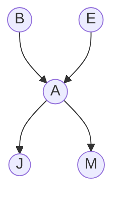

It's a way to query some probabilities on a [[Bayesian network]].
Let's assume we have a network that looks like this:

In order to compute $P(B|j,m)$ we need to do so:
$$
\begin{align}
&P(B|j,m)\\
=& \frac{P(B,j,m)}{P(j,m)}\\
=& \alpha P(B,j,m)\\
=& \sum_e\sum_a P(B,e,a,j,m)\\
=& \sum_e\sum_a P(B)P(e)P(a|B,e)P(j|a)P(m|a)\\
=& \alpha P(B) \sum_e P(e) \sum_a P(a|B,e)P(j|a)P(m|a)
\end{align}
$$
Which can be computed as a recursive algorithm that take $O(n)$ space and $O(d^n)$ time.
This is called __Enumeration inference__.

### Enumeration inference pseudocode

```python
def Enumeration_inference(X, e, bn):
	'''
	X = query variable
	e = observed values for variables E
	bn = bayesian network with variables {X} union E union Y
	'''
	Q_X = {} #distribution over X
	for x_i in X:
		e.append(x_i)
		Q_X[x_i] = enumerate_all(bn.variables, e)
	return normalize(Q_X)

def enumerate_all(vars, e):
	if len(vars) == 0: 
		return 1
	Y = vars[0]
	for y in Y
		if y in e:
			return compute_probability(y, given=y.parents)
	return sum([compute_probability(y, given=y.parents) * enumerate_all(vars - y, e.append(y)) for y in Y]) 
```

## Variable elimination

In the above query ($\alpha P(B) \sum_e P(e) \sum_a P(a|B,e)P(j|a)P(m|a)$) we have to compute some values multiple time: in particular $\sum_a P(a|B,e)P(j|a)P(m|a)$ must be solved two times: for $e$ and for $\neg e$.  Therefore, we can store inner results in order to same computational time.
Variable elimination chooses a varible ordering and tries to compute every probability containing that variable and store the value in order to save time.

## Irrelevant variables

Let's consider the following query:
$$
P(J|b) = \alpha P(b) \sum_eP(e)\sum_aP(a|b,e)P(J|a)\sum_mP(m|a)
$$
the sum over m is irrelevant to the computation since it is always 1.

__Theorem__: 
```
Y is irrelevant for the computation of P(X|E) unless Y is in the ancestor of X or E 
```
=> 
```
Y is irrelevant for the computation of P(X|E) if is D-separated from X by E
```
Therefore, we can avoid computing them.

# Complexity

The complexity of the computation of the exact inference (taking into account the variable elimination is):
- $O(d^kn)$ for singly connected graphs 
- Np-hard for multiply connected networks.

Exact inference is ok for smal or individual queries but for harder problems it is to expensive.
We can cluster some nodes together in order to have smaller graphs and save time / space but the computation is, at least $O(n^2)$ therefore very expensive.