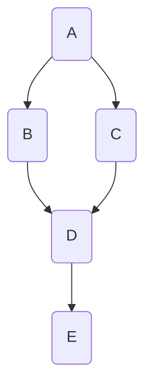

Are [[Bayesian network|Bayesian networks]] that forbids all but casually compatible ordering.
In this particular networks, the arrows are drawn not only on a probabilistic dependecy basis but also on the casuality of the nodes.
=>
$$
\begin{align}
&\forall X_i \;\text{with possible values}\; x_i = f_i(X_{i1}, \dots, X_{id})\\
&X_i \rightarrow X_j \; \text{if}\; X_j \in [X_{i1}, \dots, X_{id}] \;(\text{arguments of }f_i)
\end{align}
$$

We can now determine the state of each variable by compting the __structural equation__ ($f_i(\centerdot)$) with, as parameters, the state of the variable parents and an uncertanty parameter / error term.
Example:

=>
$$
\begin{align}
B &= f_B(A, U_B)\\
C &= f_C(A, U_C)\\
D &= f_D(B, C, U_D)\\
E &= f_E(D, U_E)\\
\end{align}
$$
## The _do_ operator

We can model an operator that act on the state of the variable (e.g. do(B = True)). This also alter the structure of the graph because, in this example, the bariable B is not on because of the state of A, but because of our intervention. So we can delete the link between A and B.

## Compact conditional distributions

With large spaces with a lot o variable, computing the full graph could be too expensive. We need to find a way to represent the graph in a compact way: we can compute the value of the variable 'on demand' based on a function that determine them.
- __Deterministic nodes__: we can simply compute the function based on his parent's values
- __Non-deterministic nodes__: compute the probability as the product of his parents and the probability of the node negate as 1 - the probability.