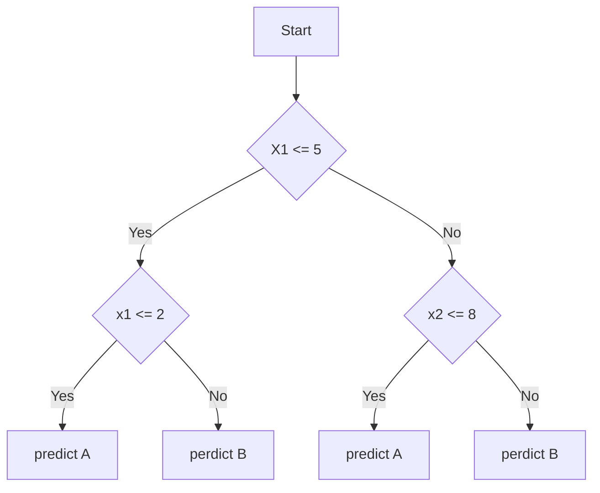

They are among the most used tools for [[Classification]]



### Pseudocode
(valid, for the sake of semplicity, for binary decision trees)
```python
def DecisionTreeFunction(attributes, node):
		if node.is_inner_node:
			subNode = PickNextNode(node, node.Test(attributes))
			return DecisionTreeFunction(attributes, subNode)
		if node.is_leaf:
			return node.prediction

def PickNextNode(node, result):
	if result == True:
		return node.trueNode
	else 
		return node.falseNode
```


## Constructing the decision tree
Given a set X of elements with a known class grown a decision tree as:
- if X is small or all element of X have a label c, generate a leaf with prediction c
- If X is large, Which attribute we choose for testing? 
	- Choose a test based on an attribute with 2 or more outcomes
	- make this test the root of a tree with a branch for each possible outcome
	- partition X in subsets corresponding to the outocomes and apply recursively the procedure

### Problems:
- Which attribute we choose for testing? -> [[Pattern finding and evaluation]]
- Which kind of test? (Binary, ternary, ...)
- What does mean "X small"? -> [[Pattern finding and evaluation]]

[[Complexity of Decision trees construction]]


## Error and overfitting

After the decision tree has been generated, we can start guessing the labels. First, we compute the labels on our train set; We will get a "small" error $x$. $x$ is called _lower limit_ and represents the smaller possible error we will have. Then we will test on our test set. The error associated with the test set will be our _upper limit_ (hopefully). It may happen that the error on the test set is way worse than that on the train set, this is called [[Overfitting with decision trees]].
In order to semplify a decision tree and reduce overfitting is by pruning it.